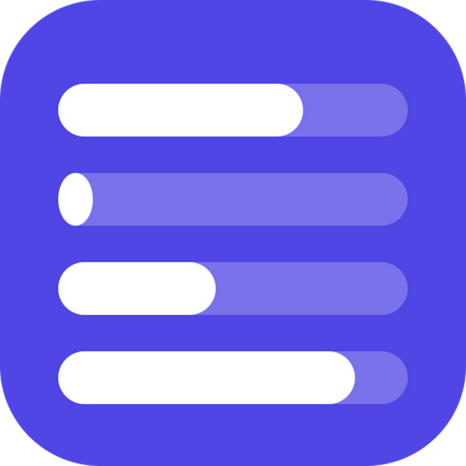

<p align="center">
  
</p>

<h1 align="center">Session Lens</h1>

<p align="center">
  Monitor your AI usage limits at a glance.
</p>

<p align="center">
  <a href="https://github.com/bariskisir/SessionLens/actions/workflows/release.yml"></a>
  <a href="https://github.com/bariskisir/SessionLens/releases/latest"></a>
  <a href="https://github.com/bariskisir/SessionLens/releases"></a>
  <a href="LICENSE"></a>
</p>

<p align="center">
  
  
</p>

**Key features**

- **Tray icon** with dynamic quota bars — green through red as limits fill up
- **Tooltip popup** with provider cards, usage percentages, and reset countdowns
- **Threshold notifications** via Windows balloon, Telegram, and Discord when limits cross high or critical levels
- **Warm-window requests** that automatically start a new session window after a usage reset so your tool is ready when you are
- **20+ AI providers** supported out of the box with API-key and OAuth authentication
- **Customizable refresh interval**, notification thresholds, tooltip scale, and icon layout

## Install

Download the latest release for your platform from [Releases](https://github.com/bariskisir/SessionLens/releases/latest).

## Development

```bash
git clone https://github.com/bariskisir/SessionLens.git
cd SessionLens
npm install
npm run dev
```

## License

MIT
