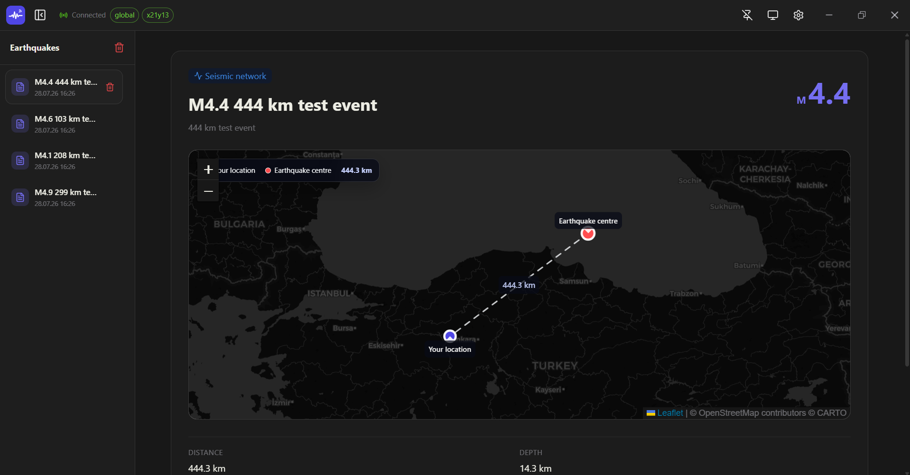
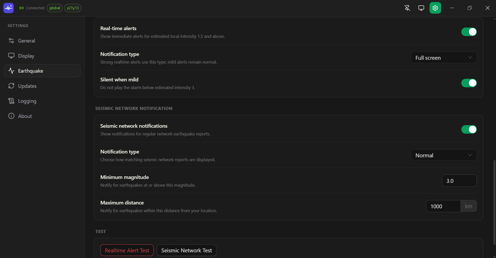
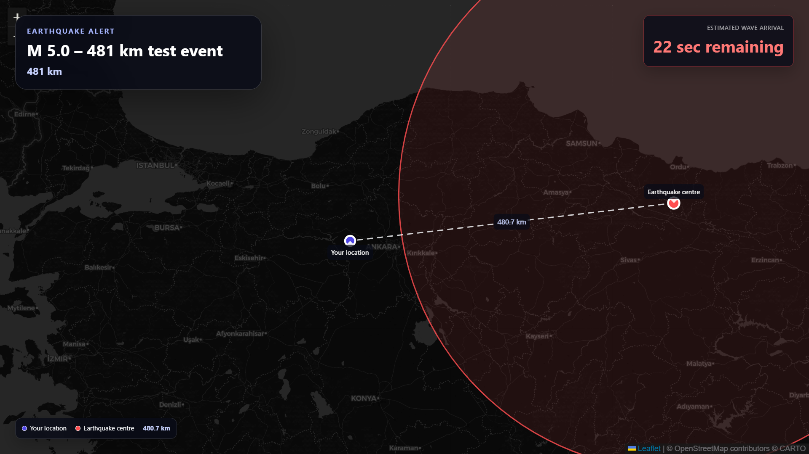

# Earthquake Signal

Earthquake Signal is an Electron desktop application that receives normal and real-time earthquake alerts, displays events and their distance from your location on a map, and provides configurable notifications and full-screen warnings.





---

## Install

1. Download the latest release for your platform from [Releases](https://github.com/bariskisir/EarthquakeSignal/releases/latest).
2. Install or extract the package.
3. Run **Earthquake Signal**.

## Development

```bash
git clone https://github.com/bariskisir/EarthquakeSignal.git
cd EarthquakeSignal
npm run dev
```

## License

MIT
